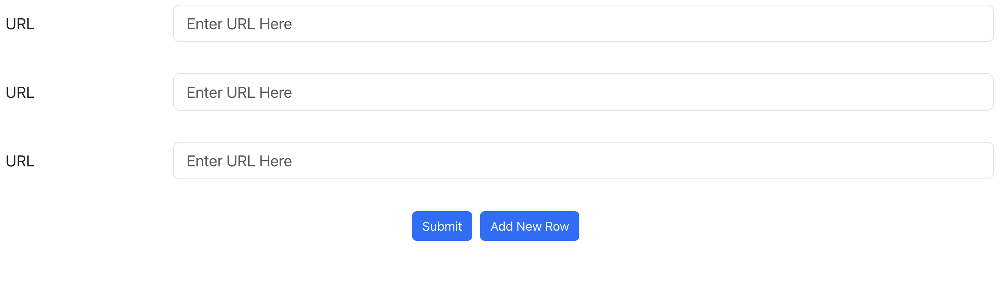
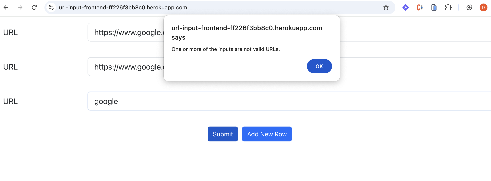
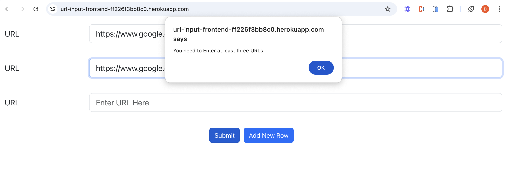
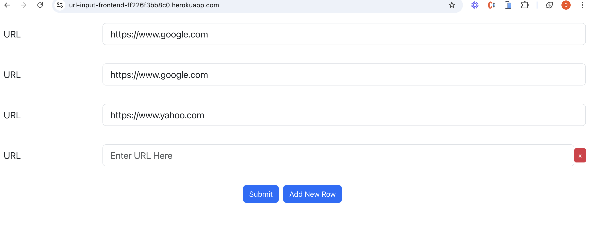
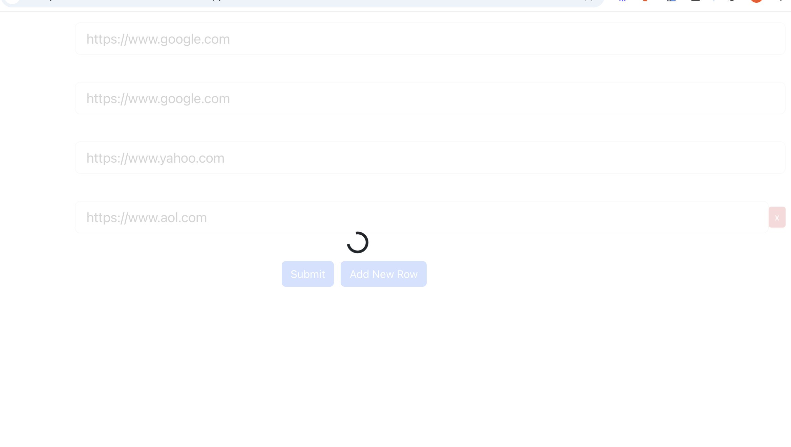
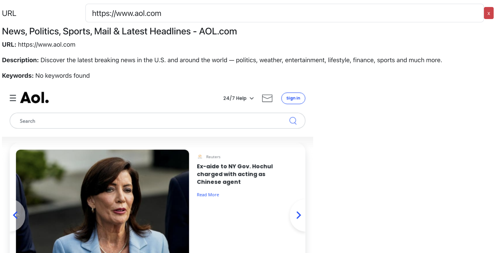

## Summary

This repository contains a full stack project written in React for the frontend and Node.js for the backend. It aims to allow users to input urls and get a brief snapshot of the urls without actually accessing them. For each url, if available, the user will be able to see keywords about the site, a description about the site, and a snapshot image of the site. Let's explore the compoenents in greater detail.

## Running the project Locally
(1) Ensure that all dependencies are installed - run npm install in both the frontend and the backend  
(2) Navigate to frontend folder and run npm start 
(3) Navigate to backend folder and run npm start

## Frontend
The frontend is written in React and employs css and bootstrap for styling. In essence, the frontend component is  merely a form which can be seen in Form.js. Upon entering the site, a form with three inputs are seen where a user can enter URLs. 

In order to submit the URLs, 2 requirements must be met:
(1) The URLs must be of an accurate URL format
(2) At least 3 URLs must be input

For example if, one of the URLs is not of the correct format, an error message will appear when attempting to submit. Likewise, if less than 3 URLs are listed, an error message will appear.

If you would like to submit more than 3 URLs you can press the 'Add New Row' button and a new row will be generated. If you would like to remove a row previously added, simply press the 'x' on the right hand side of the input.

After pressing submit, you will see a spinner load on the screen as the Frontend is fetching results from the backend.

After loading, the page will display all of your sites with relevant information. Here is an example for our last input:https://www.aol.com:

## Backend

The backend is compiled using node.js. The backend receives an object of URLs and analyzes the URLs for pertinent information. The backend employs the following node libraries: 
(1) Puppeteer - Used to create a browser to visit a url and take a snapshot  
(2) Cheerio - Used to load an html tree for parsing  
(3) Axios - Used to make an http request to a url  
(4) fs - Used to convert an image into a string that can be sent to the frontend  
(5) rateLimit - Used to limit requests on the backend 
(6) helmet - Used to protect against XSS web vulnerabilitie 

## Trade offs and Reconsiderations
If I were to build this project again, I would not use Puppeteer. Espescially when deploying to Heroku, it is a very difficult library to work with and the documentation is poor. Most of my challenges with deployment revolved around this package and relative dependencies. Additionally, for the next iteration of this code, the functions should be cleaned up and moved outside of the components. This will make for easier unit testing in the future. Lastly, the URL check function can be improved. I used a standard React URL function and it works well but requires inputs to be of the form 'https://www.example.com'. For the purposes of this project, it sufficed, but for a more user friendly-experience, the next iteration should take into account instances where the user may be less inclined to type out the entire url. 

## Unit Testing
The Unit tests can be found in the tests folders of each the backend and the frontend. 
 
 
The backend contains 5 test cases: 4 testing the extractMetaData() function and one testing the rateLimiter.
 
 
The frontend contains 6 test cases: 3 testing the FormRow component and that it is populated correctly; 2 testing that the URL validator is working correctly; and 1 that tests that the spinner is displayed when the project is loading results.
 
 
To run the unit test, simply run the command __npm run rests __tests__/app.test.js__ in each folder.
 
 
Ideally I would want to test 100% of my functionality before deploying.

